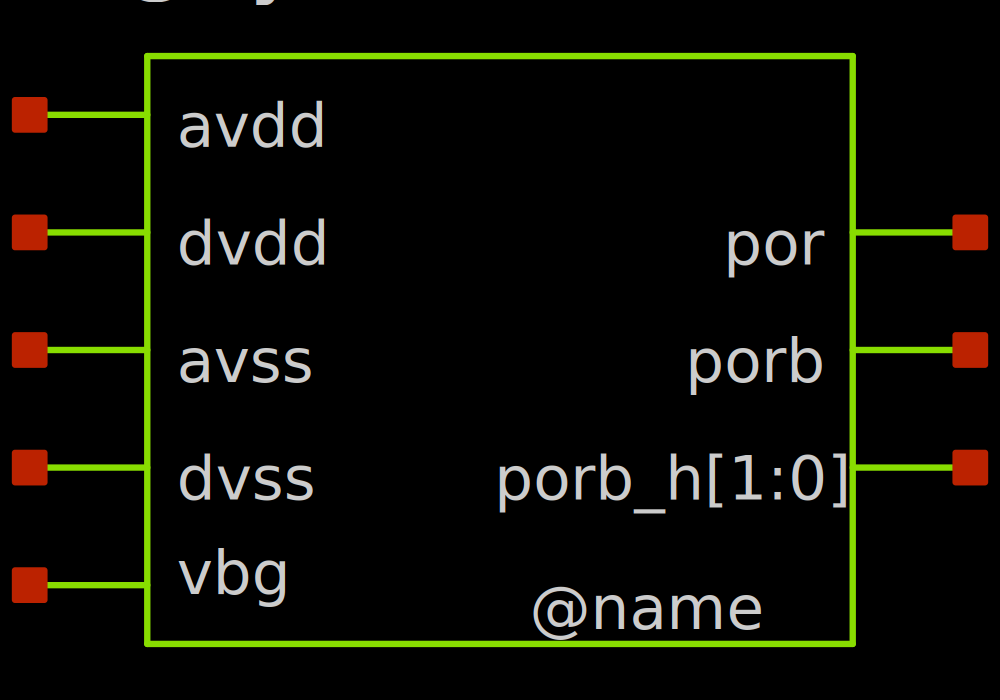
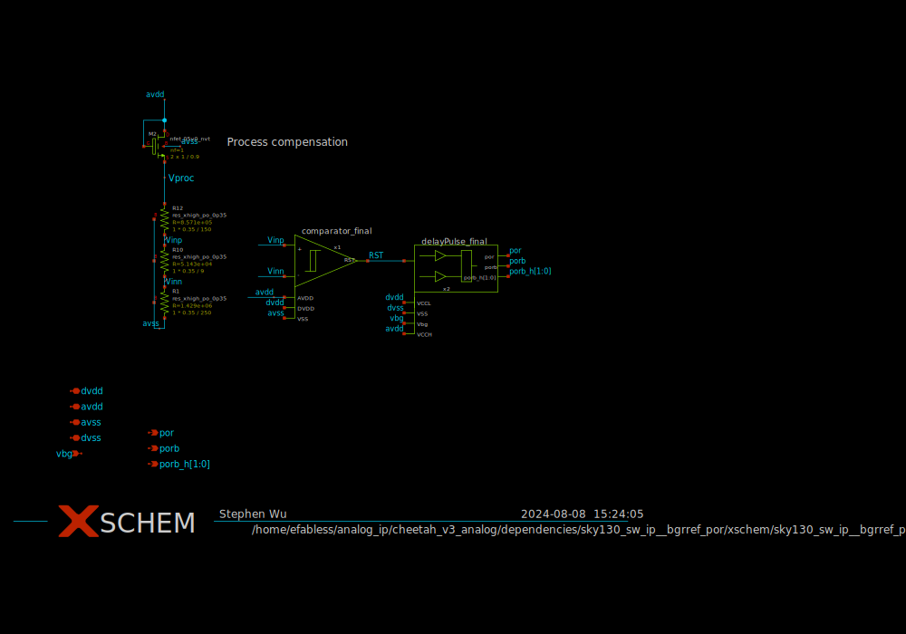
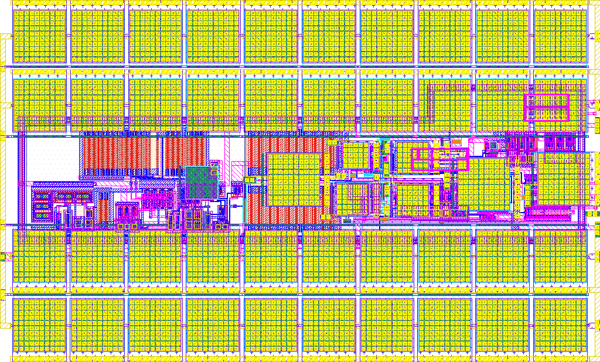
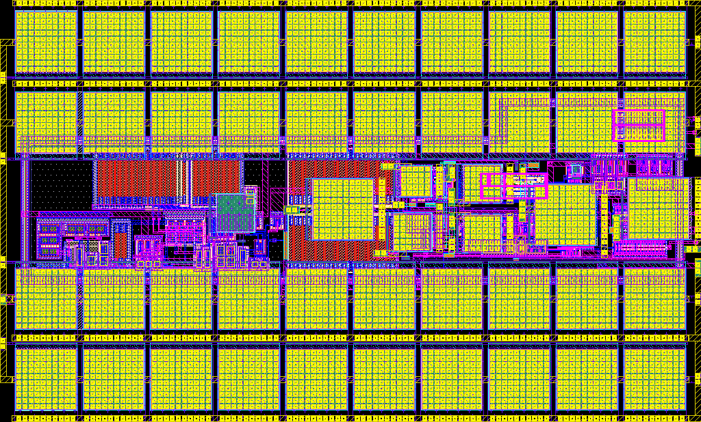

# sky130_sw_ip__bgrref_por

- Description: Bandgap-referenced Power-on-Reset
- PDK: sky130A

## Authorship

- Designer: Stephen WU
- Company: Silergy Technology
- Created: March 30, 2024
- License: Apache 2.0
- Last modified: None

## Pins

- vbg
  + Description: input bandgap voltage reference
  + Type: analog
  + Direction: input
  + Vmin: 1.08
  + Vmax: 1.32
- por
  + Description: reset signal in dvdd domain
  + Type: signal
  + Direction: output
  + Vmin: 0
  + Vmax: Vdvdd
- porb
  + Description: reset bar signal in dvdd domain
  + Type: signal
  + Direction: output
  + Vmin: 0
  + Vmax: Vdvdd
- porb_h[1:0]
  + Description: reset bar signal in avdd domain
  + Type: signal
  + Direction: output
  + Vmin: 0
  + Vmax: Vavdd
- dvdd
  + Description: Digital power supply
  + Type: power
  + Direction: inout
  + Vmin: 1.64
  + Vmax: 1.96
- dvss
  + Description: Digital ground
  + Type: ground
  + Direction: inout
  + Vmin: 0
  + Vmax: 0.3
- avdd
  + Description: Analog power supply
  + Type: power
  + Direction: inout
  + Vmin: 2.7
  + Vmax: 5.5
- avss
  + Description: Analog ground
  + Type: ground
  + Direction: inout
  + Vmin: 0
  + Vmax: 0.3

## Default Conditions

- Vavdd
  + Description: Analog power supply voltage
  + Display: avdd
  + Unit: V
  + Typical: 3.3
- Vavss
  + Description: Analog ground
  + Display: avss
  + Unit: V
  + Typical: 0
- Vdvdd
  + Description: Digital power supply voltage
  + Display: dvdd
  + Unit: V
  + Typical: 1.8
- Vdvss
  + Description: Digital ground
  + Display: dvss
  + Unit: V
  + Typical: 0
- Vvbg
  + Description: bandgap reference voltage
  + Display: vbg
  + Unit: V
  + Typical: 1.2
- CLw
  + Description: chip distributed wiring capacitive load seen by porb_h signal
  + Display: Cload_wiring
  + Unit: pF
  + Typical: 1
- CLb
  + Description: estimated digital buffers load seen by por & porb signals
  + Display: Cload_buffers
  + Unit: fF
  + Maximum: 200
- temperature
  + Description: Ambient temperature
  + Display: Temp
  + Unit: °C
  + Maximum: 85
- corner
  + Description: Process corner
  + Display: Corner
  + Maximum: ff
- travdd
  + Description: Analog supply rising time
  + Display: Avdd_tr
  + Unit: mS
  + Typical: 1
- trdvdd
  + Description: Digital supply rising time
  + Display: Dvdd_tr
  + Unit: mS
  + Typical: 1
- Tsim
  + Description: transient simulation time
  + Display: Tsim
  + Unit: mS
  + Typical: 120
- Tstep
  + Description: transient simulation max time step
  + Display: Tstep
  + Unit: uS
  + Typical: 0.2

## Symbol

## Schematic

## Layout

