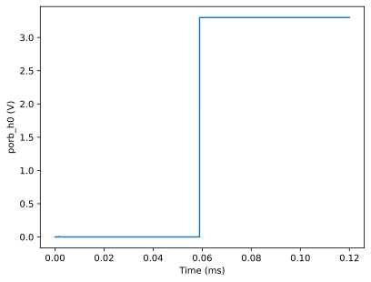

# CACE Summary for sky130_sw_ip__bgrref_por

**netlist source**: rcx

|      Parameter       |         Tool         |     Result      | Min Limit  |  Min Value   | Typ Target |  Typ Value   | Max Limit  |  Max Value   |  Status  |
| :------------------- | :------------------- | :-------------- | ---------: | -----------: | ---------: | -----------: | ---------: | -----------: | :------: |
| Power Consumption    | ngspice              | Iavg                 |             any |          ​ |         3 uA |          ​ |         5 uA |          ​ |   Skip 🟧    |
| Steady-State Power Consumption | ngspice              | Iavg_ss              |             any |          ​ |          any |          ​ |          any |          ​ |   Skip 🟧    |
| Output Reset Threshold Voltage | ngspice              | V_thp                |           2.4 V |          ​ |        2.7 V |          ​ |          3 V |          ​ |   Skip 🟧    |
| Reset Active Time    | ngspice              | porPulse             |           30 mS |          ​ |        50 mS |          ​ |       100 mS |          ​ |   Skip 🟧    |
| Vlow_por             | ngspice              | Vpor_low             |             any |          ​ |        0.1 V |          ​ |        0.3 V |          ​ |   Skip 🟧    |
| Vlow_porb            | ngspice              | Vporb_low            |             any |          ​ |        0.1 V |          ​ |        0.3 V |          ​ |   Skip 🟧    |
| Vlow_porb_h          | ngspice              | Vporb_h_low          |             any |          ​ |        0.1 V |          ​ |        0.3 V |          ​ |   Skip 🟧    |
| por_deviation_from_supply | ngspice              | Vpor_high_delta      |          -0.2 V |          ​ |          0 V |          ​ |          any |          ​ |   Skip 🟧    |
| porb_deviation_from_supply | ngspice              | Vporb_high_delta     |          -0.2 V |          ​ |          0 V |          ​ |          any |          ​ |   Skip 🟧    |
| porb_h_deviation_from_supply | ngspice              | Vporb_h_high_delta   |          -0.2 V |          ​ |          0 V |          ​ |          any |          ​ |   Skip 🟧    |
| Hysteresis Voltage   | ngspice              | hyst                 |           0.1 V |          ​ |        0.2 V |          ​ |        0.3 V |          ​ |   Skip 🟧    |
| detectable supply glitch duration | ngspice              | Vglitch_dur          |             any |          ​ |          any |          ​ |          any |          ​ |   Skip 🟧    |
| detectable supply glitch amplitude | ngspice              | Vglitch_amp          |             any |          ​ |          any |          ​ |          any |          ​ |   Skip 🟧    |
| Area                 | magic_area           | area                 |               ​ |          ​ |            ​ |          ​ |          any |          ​ |   Skip 🟧    |
| Width                | magic_area           | width                |               ​ |          ​ |            ​ |          ​ |          any |          ​ |   Skip 🟧    |
| Height               | magic_area           | height               |               ​ |          ​ |            ​ |          ​ |          any |          ​ |   Skip 🟧    |
| Magic DRC            | magic_drc            | drc_errors           |               ​ |          ​ |            ​ |          ​ |            0 |          ​ |   Skip 🟧    |
| Netgen LVS           | netgen_lvs           | lvs_errors           |               ​ |          ​ |            ​ |          ​ |            0 |          ​ |   Skip 🟧    |
| KLayout DRC full     | klayout_drc          | drc_errors           |               ​ |          ​ |            ​ |          ​ |            0 |          ​ |   Skip 🟧    |

## Plots

## Supplies

## por

## porb

## porb_h0

